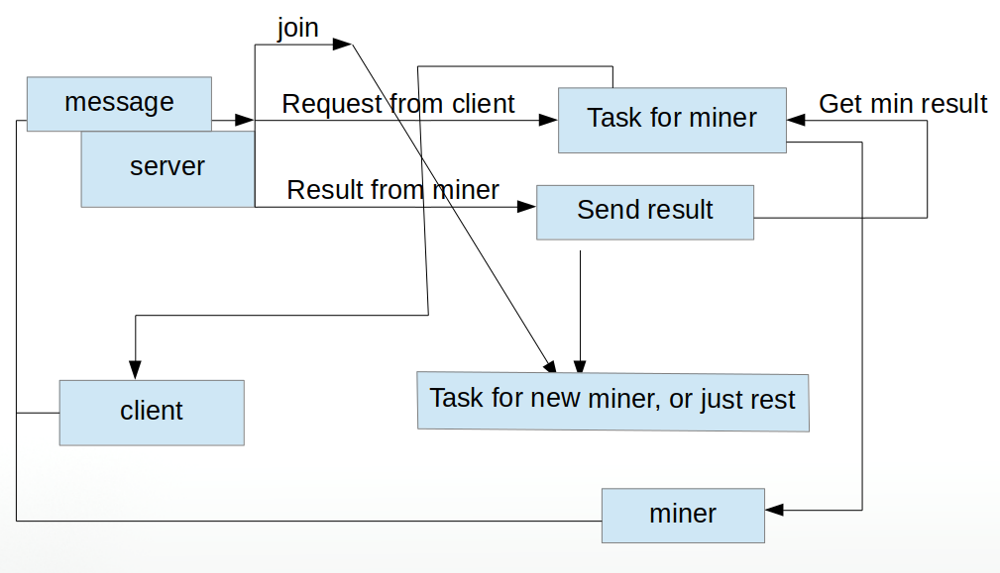

# simple_miner

这算是学习Go的一个小练习。实现一个简单的分布式系统，熟悉一下websocket协议和goroutine，channel的使用。程序有三个组件，client，miner，server，client提出request给server，server会把任务分发给miner，miner的结果返回给server后，server把结果发送给client。

## websocket

程序是用websocket来通信的。首先得说为什么需要websocket，因为HTTP协议本身的缺陷，它是单向连接的，通信只能由客户端发起，服务器返回查询结果，无法让服务器主动向客户端推送消息。如果服务器有了状态变化，客户端要获知就非常麻烦，只能采用“轮询”的方式，非常浪费资源。而websocket是全双工的，可以双向平等对话，也是基于TCP协议。Go中有websocket的包，[http://github.com/gorilla/websocket](http://github.com/gorilla/websocket)。

## 挖矿

最近区块链挺火的，虽然现在感觉还都是泡沫，不知道未来会如何。在比特币里，为了防止人进行“双花”，用工作量证明(PoW)的方式，也就是挖矿。挖矿就是说miner们在解一道很困难的数学题，这需要耗费大量的算力，算出来的miner就可以获得比特币奖励。假设现在，每个矿工会得到一个string message “msg”和一个nonce值(这个值会很大)，会从**hash("msg", 0)**开始尝试，一直到**hash("msg", nonce)**结束，希望可以计算出一个最小的哈希值，而这只能进行暴力尝试，所以可以用分布式的方式来做，把任务分配给多个miner。

## 结构

瞎画一波，还是看代码比较好。。用channel来做异步非常舒服。